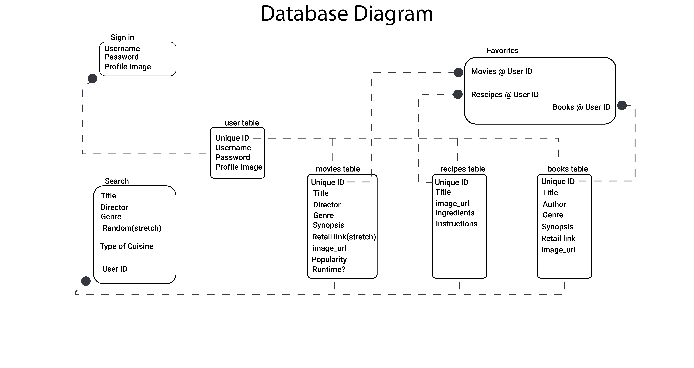
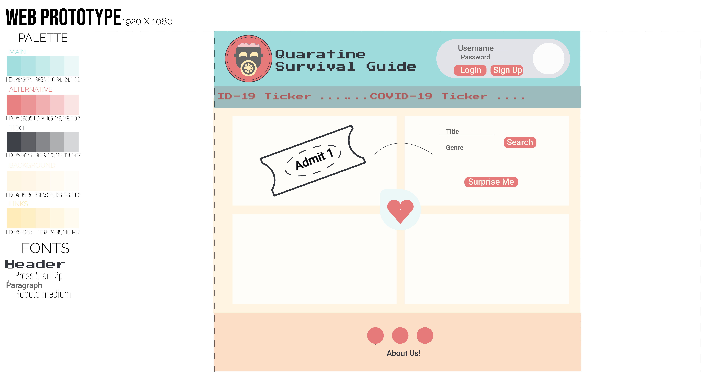
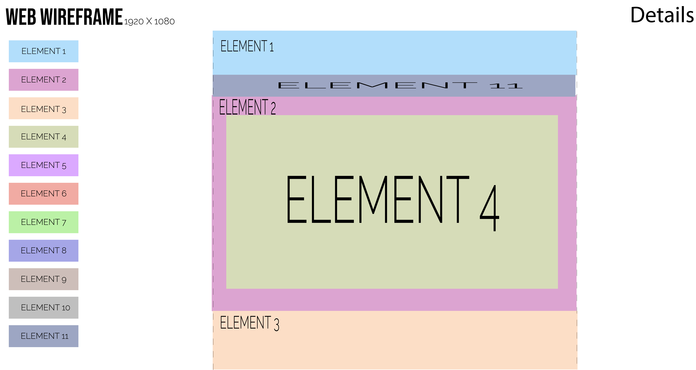
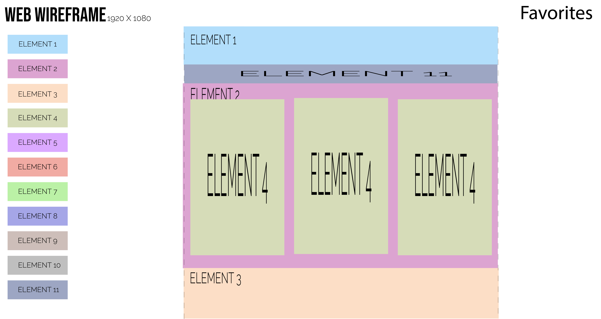
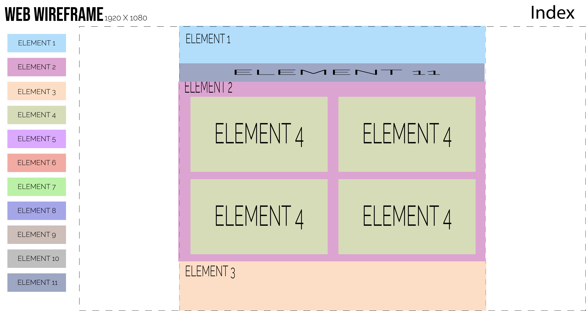
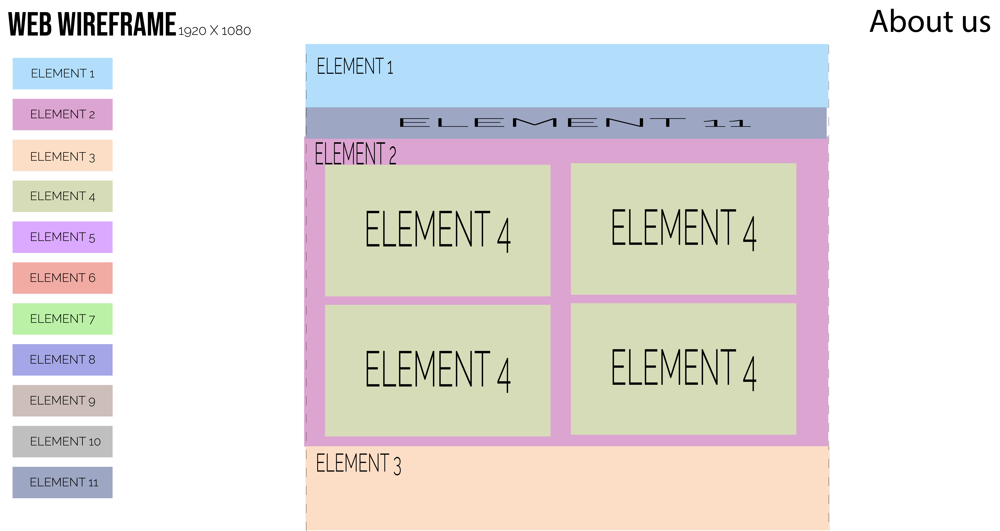

# 301d61-class-project
Group final project for Code Fellows seattle-301d61 

## Authors:
* Volha Charnysh
* Kent Sheats
* Paul Depew
* Joe Pennock

## Overview
This an an app that allows a user to search for movies, recipes, and books.  The user will have the ability to save their information to be accessed at a later point of time.

## Table of Contents
- [Credits and Collaborations](#Credits-and-Collaborations)
- [Quarantine Survival Kit](#Quarantine-Survival-Kit)
- [USER STORIES](#USER-STORIES)
- [Communication Plan](#Communication-Plan)
- [Conflict](#Conflict)
- [Work Plan](#Work-Plan)
- [Git Process](#Git-Process)
- [Scope](#Scope)
- [Functional Requirements](#Functional-Requirements)
- [Non-Functional Requirements](#Non-Functional-Requirements )
- [DOMAIN MODELING](#DOMAIN-MODELING)
- [Wireframes](#Wireframes)

## Getting Started
Install dependencies

## Architecture
- EJS
- Express
- Superagent
- Dotenv
- JavaScript
- HTML
- CSS
- SQL
- jQuery
- Method-Override

## Change Log

## Version History
<!-- Key: major.minor.patch  -->
* 1.0.0 20200428
  - Project repo created. Added basic file structure.

## Credits and Collaborations
### API's used: 
- Movies: [TMDB](https://www.themoviedb.org/documentation/api)
- Books: [Google Books](https://developers.google.com/books/docs/overview)
- Recipes: [EDAMAM](https://developer.edamam.com/edamam-recipe-api)
- User Icons: [Adorable Avatars](http://avatars.adorable.io/)
- COVID Data:[The COVID Tracking Project](https://covidtracking.com/api) 
### Fonts:
- [Google Fonts](https://fonts.google.com/)
  - Press Start 2p and Roboto
### Reset CSS:
- [Reset CSS](http://meyerweb.com/eric/tools/css/reset/)
### Links 
- [Where to Watch Movies Link](https://www.justwatch.com/)
- 
## Quarantine Survival Kit: 

*As a user I would like to have a clean, simple UI where I can enter a category that I want to learn more about and be presented with a random selection of things based off that category: ie: workout routines, movies, wines, travel destinations, books, new hobby, meetups, recipes based on place*

1. Server with saved items that can randomly generate/suggest
2. Movies based on popularity
3. Display options based on search
4. Recipes based off of cuisines type
5. Show recipes
6. Steps, Ingredients
7. Save a grocery list
8. Show grocery store near this location
9. Books 
10. Display a Selection of books,
11. Click on book, gives similar books
12. Same genre?
13. Synthesized User Profile creation and sign-in 
14. Persistent cookie to keep signed in?
15. 10-15 minute time frame? Cookies

[Return to top](#301d61-class-project)
## USER STORIES:
### Story 1:
#### User Profiles
- I, as a user, would like the site I interact with often to remember my settings and choices.
- Create a sign-in/up form which saves a user profile to the DB
- Can save and recall/sign-in a user

### Story 2:
#### Movie recommendations
- I, as a user, would like to search for movie recommendations based on keyword or title.
Given the user inputs a valid genre or title, when they click on a button and then the top 10 movie recommendations are displayed on the /display page.
- The user can view and save the movie recommendations to the database.  The display will include title, synopsis, director, image, genre, popularity, and run time.
- Stretch Goal: Display a random movie recommendation.

### Story 3:
#### Recipes
- I, as a user, would like to search for a cuisine type and receive recipe ideas based on my search.
- Given the user inputs a valid cuisine type, when they click on a button the top 10 recipes recommendations are displayed on the /display page.
- The user can view and save the recipes that they like to the database.  The display will include title, image, ingredients and instructions.
- Stretch Goal: Save a grocery list
  - Show grocery store near this location

### Story 4:
#### Books
- I, as a user, would like to search books based on the genre, author or title.
- Given the user inputs a valid book genre, author or title, when they click on a button then the top 10 book recommendations are displayed on the /display page.
- The user can view and save the books that they like to the database.  The display will include title, synopsis, author, image.
- Stretch Goal: After a recommendation is chosen allow the user to click on a button and generate 10 more recommendations based on this title.
- Stretch Goal: Display a link to a retailer to purchase the book.

### Other Stretch Goals:
- Exercise recommendations.
- Beverage selections.
- Bored API display random ideas of new activities to kill time

[Return to top](#301d61-class-project)
## Communication Plan: 
- Discord for Project meetings and group work
- Trello for assignment tracking
- Google Drive for Files
- 9:30 am daily stand up
## Conflict:
- Whenever we come to a decision point, you must say something.
- Feel free to say anything.
## Work Plan:
- Commitment to working between the hours of 9-6
## Git Process: 
- Joe will be the git manager
  - 1 other approval per development
  - 3 other approval for master   

[Return to top](#301d61-class-project)
## Vision
### What is the vision of this product?
As a user I would like to have a clean, simple UI where I can enter a category that I want to learn more about and be presented with a random selection of things based off that category.  The categories that we are offering recommendations for include movies, recipes, and books.  The user will have the ability to save their information to be accessed at a later point of time.

### What pain point does this project solve?
This application will offer users the ability to experience some new recipes, movies and books to help to break up the monotony of the quarantine life.  It takes the pain out of searching for new things to eat, watch and read, saving you time.  
### Why should we care about your product?
It is a way to explore the vastness of the world wide web.  We are helping to broaden your horizons by offering new experiences while you are stuck at home.  We make it easy to save your recommendations to be revisited at a later time.

[Return to top](#301d61-class-project)
## Scope (In/Out)
### IN - What will your product do
Server with saved items that can randomly generate/suggest
Movies based on title, director, and genre
Display options based on search
Recipes based off of cuisines type
Show recipes
Steps, Ingredients
Save a grocery list
Show grocery store near this location
Books based off of title, and author
Display a Selection of books,
Click on book, gives similar books
Same genre?
Synthesized User Profile creation and sign-in 
Persistent cookie to keep signed in?
10-15 minute time frame? Cookies

### OUT- What will the product not do
We will not charge for the use of our product.
Minimum Viable Product vs
The user will be able to search for recommendations for the following categories:
Movies based on title, director, and genre
Recipes based off of cuisines type
Books based off of title, and author
The user will be able to create a profile.
The user will be able to save their favorite recommendations to their profile to be accessed at a later time. 
The user will have the ability to remove saved items from their profile.
### Stretch goals
- Stretch Goal: After a recommendation is chosen allow the user to click on a button and generate 10 more recommendations based on this title.
- Stretch Goal: Display a link to a retailer to purchase the book.
- Stretch Goal: Save a grocery list and show grocery store near their location
- Stretch Goal: Display a random movie recommendation.
## Functional Requirements
### Data Flow

[Return to top](#301d61-class-project)

## Non-Functional Requirements 
### Security
  - All of our forms are security enabled to prohibit data attacks.
  - All of our API keys will be placed within our environmental variables.  
  - All of our SQL values will be obfuscated.  
  - We will validate for HTTPS in the URL.
### Usability
  - Fully working from all states and multiple origins. 
  - Fully compliant with all Web Accessibility Initiative (WAI) checks.  
  - The amount of the clicks to obtain your goal will be efficient and optimized.
  - Our documentation will be fully replicable and readable
  - The user interface will be designed in such a way that the user can quickly figure out their goal and how to obtain it.
## DOMAIN MODELING: 

## Wireframes:

- [Return to top](#301d61-class-project)

